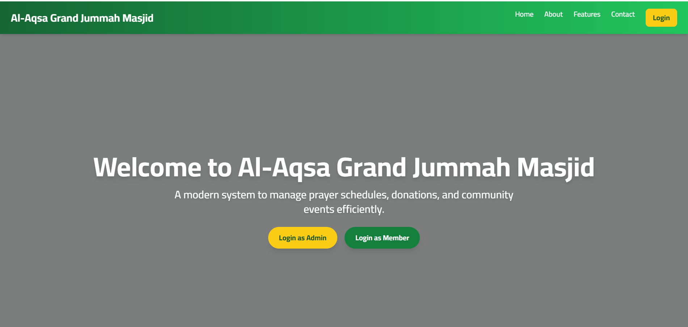
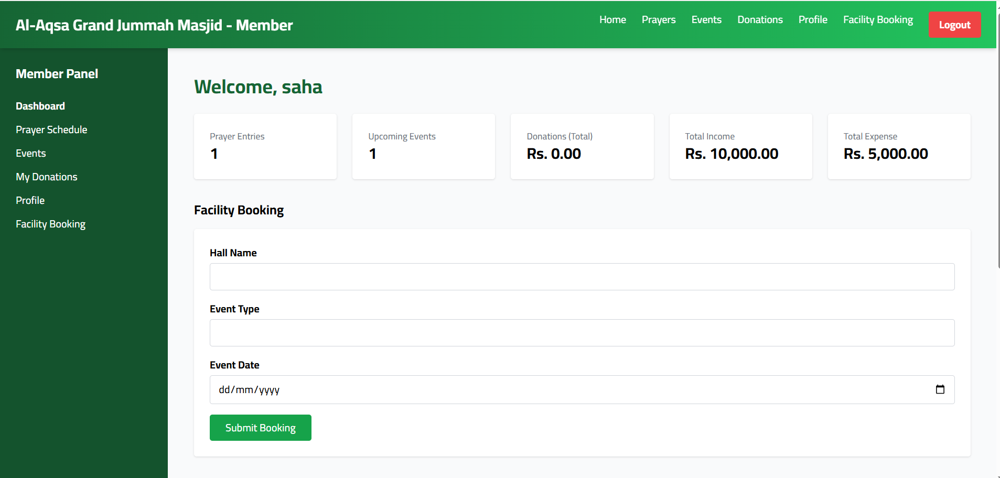
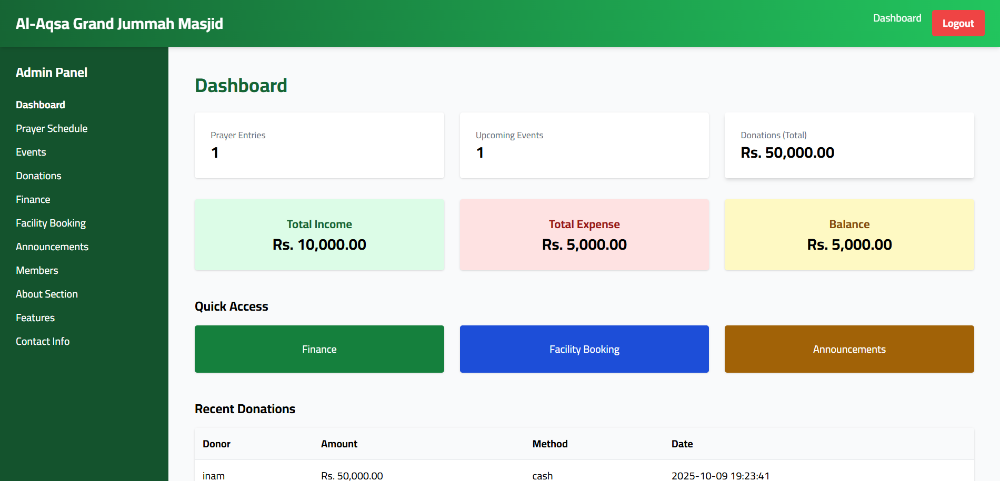

# 🕌 Masjid Website

A simple and modern Masjid (Mosque) website designed to provide essential information to the community.  
This project is suitable for small to medium mosques and can be customized easily.

---

## 📖 Project Overview

This website is developed to display:
- Masjid details
- Prayer times
- Announcements & events
- Image gallery
- Contact information

The design is clean, responsive, and user-friendly for all age groups.

---

## 🚀 Features

- 🕋 Masjid introduction section  
- ⏰ Prayer time display  
- 📢 Announcements / notices  
- 🖼️ Image gallery section  
- 📞 Contact details  
- 📱 Mobile responsive layout  

---

## 🛠️ Technologies Used

- HTML5  
- CSS3  
- JavaScript  
- PHP (if backend is used)  
- Bootstrap / Tailwind CSS (if applicable)

---

## 📂 Folder Structure

masjid/
│── assets/
│ ├── css/
│ ├── js/
│ └── images/
│── includes/
│── index.php / index.html
│── contact.php
│── gallery.php
│── README.md


---

## ⚙️ Installation & Setup

1. Download or clone this repository
   ```bash
   git clone https://github.com/your-username/masjid-website.git


Move the project to your server directory
(e.g., htdocs for XAMPP)

Start Apache (and MySQL if PHP is used)

Open browser and visit:

http://localhost/masjid

✏️ Customization

Update Masjid name and details in the main files

Replace images inside assets/images

Modify prayer times as needed

Add new pages easily

## 🖼 Website Preview / Screenshots

<div align="center">

### 🏠 Landing Page


### ⏰ Member



### 🖼 Gallery Section


### 📩 admin Section


</div>

🤝 Contribution

Contributions, suggestions, and improvements are welcome.
Feel free to fork this project and submit a pull request.

📜 License

This project is free to use for educational and community purposes.

👤 Author

Aflal 
Web Developer & Designer
🔗 Portfolio: https://aflalmohamed.github.io/MyPortFolio/